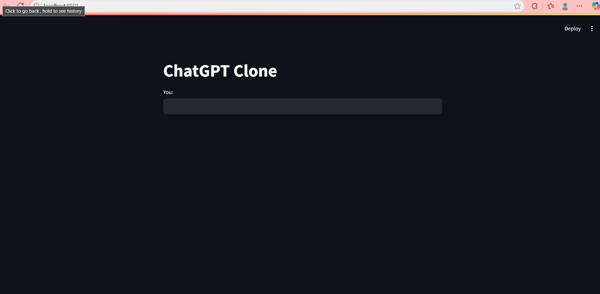

# 🧠 ChatGPT Clone using Streamlit

A simple chatbot UI made using **Streamlit**.  
This is part of my Generative AI learning journey 💡.

---

## 🚀 Features
- 💬 Chat interface
- 📦 Easy to run
- 🧱 Simple design

---

## 📸 Screenshot



---

## 🛠️ How to Run

```bash
pip install -r requirements.txt
streamlit run app.py
